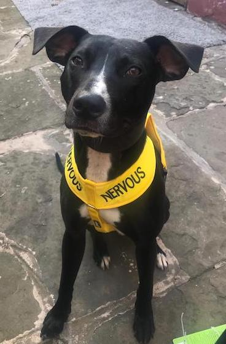

```{r, libs, echo=FALSE}
library(metathis)
knitr::write_bib(c(.packages(), "bookdown"), "packages.bib")
```

```{r, metathis, echo=FALSE, warning=FALSE}
library(metathis)
meta() %>%
  meta_description(
    "Leo the lurcher"
  ) %>% 
  meta_name("github-repo" = "chris-gaskell/leo-lurcher/book") %>% 
  meta_viewport() %>% 
  meta_social(
    title = "Leo the Lurcher",
    url = "https://leo-biography.netlify.app",
    image = "https://github.com/chris-gaskell/leo-lurcher/blob/main/book/images/nervous_leo.jpeg?raw=true",
    image_alt = "picture of Leo",
    og_type = "book",
    og_author = c("Chris Gaskell", "Leo de Lurchio"),
    twitter_card_type = "summary",
    twitter_creator = "@cgaskell92"
  )
```

# Leo the Lurcher {-}

<div style= "float:right;position: relative; top: 0px;">
```{asis, echo=!knitr::is_latex_output()}
<p style="text-align: center;"><a href=""></a></p>

```

</div>

Thank you for buying my first book!

My name is Leo. I'm a 4 year old lurcher pup. This book is all about what it means when dogs like me get the barks and how you can help us to feel better.

This book should be seen as resource to help you out with your pup. This should be seen as a replacement for individual advice from a well trained professional.

I take 0 liability for anything that happens to you from reading this book. If you are concerned about any of the suggestions in this book then feel free to discuss them first with your veterinary specialist.


```{asis, echo=!knitr::is_latex_output()}
::: {.infobox .caution}
**Note**: This book has yet to be picked up by a major publisher. The online version of this book is free to read here, and licensed under the [Creative Commons Attribution-NonCommercial-ShareAlike 4.0 International License](http://creativecommons.org/licenses/by-nc-sa/4.0/). If you have any feedback, please feel free to [file an issue on GitHub](https://github.com/chris-gaskell/leo-lurcher/book). Thank you!
:::

# Incase you think about leaving!...

before you think about leaving... let me leave you with a little message.
<p style="text-align: center;"><a href="https://www.routledge.com/p/book/9780367563837"></a></p>
```

# How to use this book {-}

I recommend that you read this book cover-to-cover.

I have included some boxes to help you out while reading. These include raise a paw (i.e., common questions), have a treat (i.e., here is a tip), and lets go for a walk (try it yourself).

```{asis, echo=!knitr::is_latex_output()}
::: {.pawcomment}
### Raise a paw {-}
If you have a question. Simply raise a paw.
:::

::: {.bonecomment}
### Have a treat {-}
Here is a greatttttt tip!
:::

::: {.dogcomment}
### Have a treat {-}
Here is a greatttttt tip!
:::
```


Have fun!

# Acknowledgements

# About thr author


::: {.flushright data-latex=""}
Woof, woof

Leo de Lurchio  
Manchester, UK
:::


